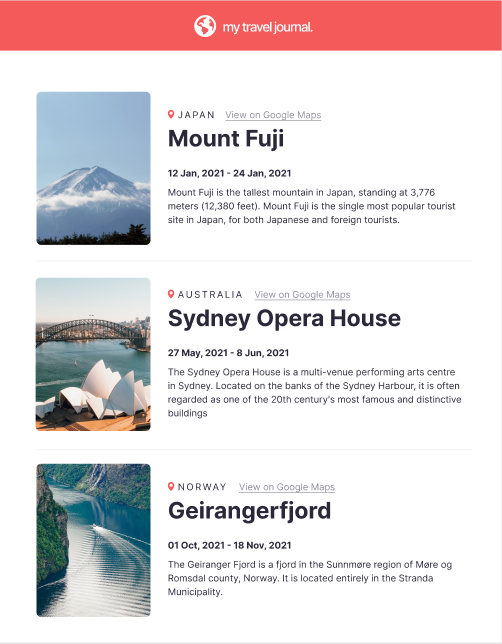

This project was bootstrapped with [Create React App](https://github.com/facebook/create-react-app).

# My Travel Journal

This project was completed as part of the Scrimba learn React course.

## Site overview

My travel journal is a single page project constructed in React that utilises the repeat component functionality to render a number of cards via a single piece of code. 

## Project requirements

The project required the website to built using React and comprising a repeat componet that has scalability.

