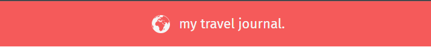
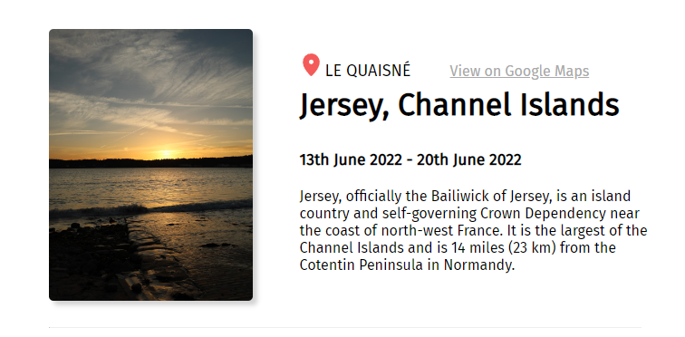

This project was bootstrapped with [Create React App](https://github.com/facebook/create-react-app).


# My Travel Journal

This project was completed as part of the [Scrimba](https://scrimba.com) learn React course.


## Site overview

My travel journal is a single page project constructed in React that utilises the repeat component functionality to render a number of cards via a single piece of code. 


## Project requirements

The project required the website to built using React and comprising a repeat componet that has scalability.


*The image provided for the required setup of the page*

## Site design

### Basic setup

The basic setup of the site design is to have a simple header component, and then a <Card /> component that will be conditionally rendered a number of times based on the content of a JavaScript array.

### Header



*The header is a simple design*

The header component is a simple design with a globe SVG and a centered text. Colour was taken from the required sample image.

### Location card



*The card component of the website*

The card component of the website comprises two flex containers, one for the image, and one for the text.

```
            <div className="card">
                <div className="card-img-box">
                
                </div>
                <div className="card-content-box">
                <div className="card-location">
                    <div className='card-location-span'>
                        <a className='google-link-icon' href={props.googlemap} target="blank"><Pin /></a>
                        <h2>{props.location}</h2>
                        <a className='google-link' href={props.googlemap} target="blank">View on Google Maps</a>
                    </div>
                </div>
                <div className="card-name"><h1>{props.name}</h1></div>
                <div className="card-date"><h3>{props.date}</h3></div>
                <div className="card-description"><p>{props.description}</p></div>
                </div>
            </div>
            <hr class="solid"></hr>
        </>
```

This card reads from a JSX file named 'location.jsx' that returns an array of objectives with the following properties:

```
    { 
        id: {ID number of the object}
        photoImg: {reference to the locaiton of the image}
        location: {the location, also used as the alt to the image}
        googlemap: {link to the googlemap geolocation}
        name: {main title name}
        date: {date of the trip}
        description: {short description of the location}
    },
```

For this website at the moment, 3 trips have been inputed.

## Performance metrics 